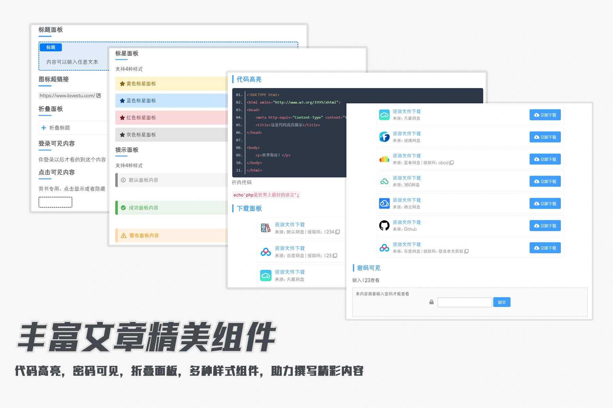
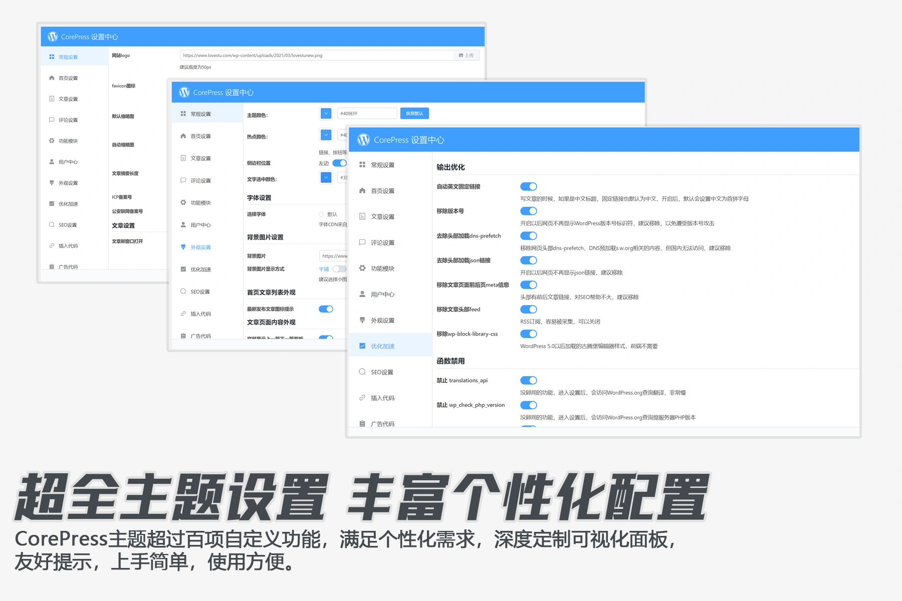
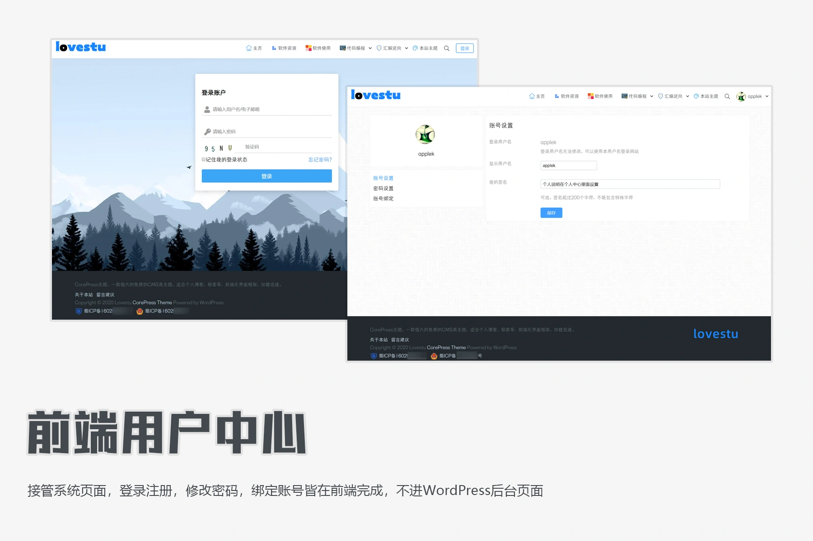
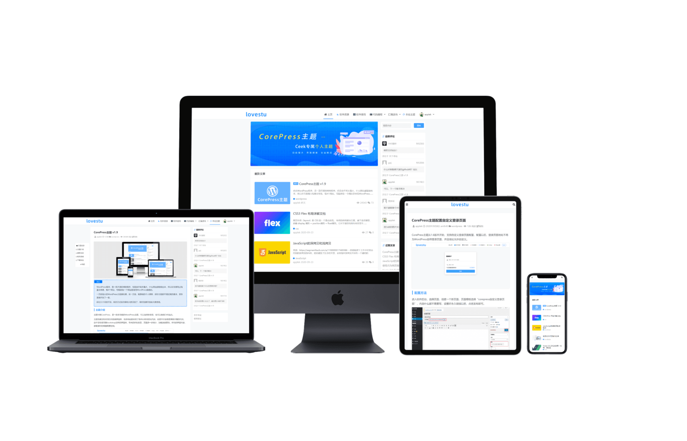

## CorePress Theme

CorePress，是一款多功能的WordPress主题，专为极客制作的一款主题，主题功能完善，设置丰富。

WordPress深度优化，颜值与性能并存，你想要的功能他都有，干掉收费主题，从这儿开始。

### 主题特色

* 超小体积

  主题体积小于2m，代码精，功能全，颜值高，兼容好。

* 无框架设计
  主题无前端界面库框架，代码为作者手撸，体积小，兼容好。
* 大量优化功能
  深度优化WordPress，干掉没有卵用的函数，让后台访问更快，再也不用莫名其妙的等待好多秒了。
* 响应式设计
  主题采用响应式设计，完美兼容PC端、手机端和平板等各类设备访问

* 个性化主题设置
  主题提供可视化设置面板，可自定义配置超过即几十项，比一些收费的主题功能还多。
  支持自定义配色，允许设置主色调，侧边栏显示方式，显示幻灯片等配置。

* SEO友好
  主题自带SEO配置，智能设置每篇文章SEO功能，并提供文章独立SEO配置。

* 编辑器增强
  自带多种功能短代码，让文章撰写更方便。支持代码高亮，方便快捷插入与编辑代码
*  webp，SVG支持
  支持webp，SVG上传、显示。
*  多个小工具
  主题自带多种小工具，最新评论，作者信息，热门文章
*  前端用户中心
  开启用户中心，接管WordPress自带登录页面，注册页面，找回密码页面，同时自定义个人中心设置页面，支持修改昵称，签名，修改密码，绑定账号。
* 多种功能模块
  防红模块，禁止文章复制，WordPress邮件配置，图片灯箱  

### 环境要求
PHP版本5.6以上，WordPress 5.0+

推荐使用宝塔建站

### LICENSE 

遵循GPL协议，非商业用途免费使用 ，请保留底部版权

### 使用文档

大多数的使用方法都写到文档了，有问题先看文档，能解决百分之90的问题

[https://www.yuque.com/applek/corepress](https://www.yuque.com/applek/corepress)

### 演示地址

[https://www.lovestu.com/](https://www.lovestu.com)  

